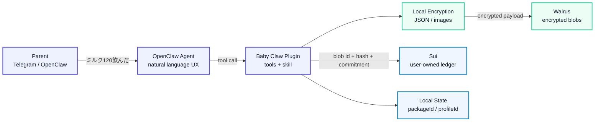
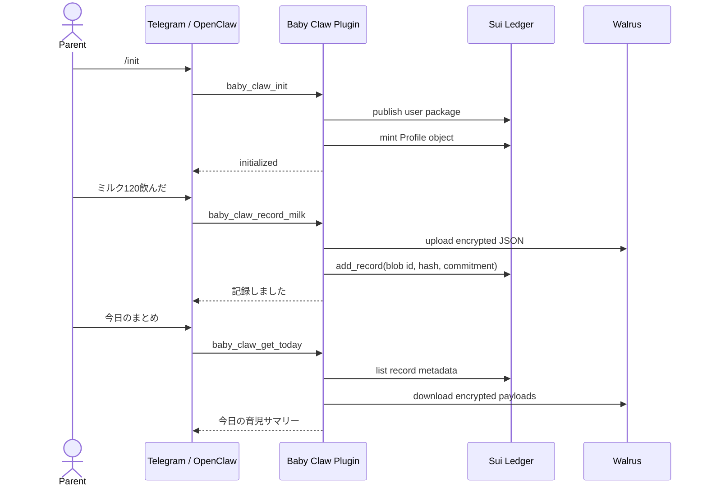
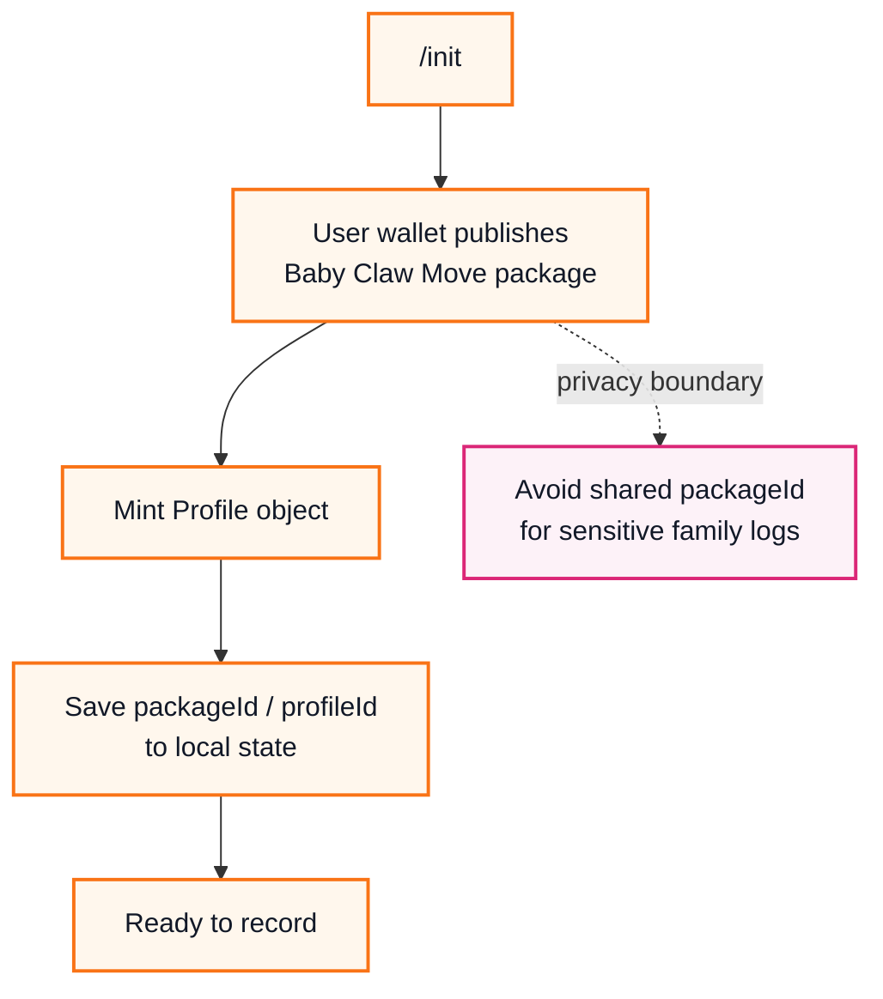
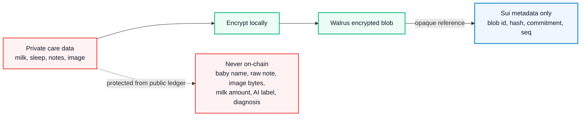

<div align="center">

# Baby Claw

**Privacy-first baby care records for OpenClaw, Sui, and Walrus.**

English TL;DR: Baby Claw is an OpenClaw plugin MVP for recording baby care events through chat while keeping sensitive details encrypted off-chain. Sui stores only privacy-neutral verification metadata, and Walrus stores encrypted payloads and images.


</div>

## 何を作ったか

Baby Claw は、Telegram / OpenClaw から「ミルク120飲んだ」「寝た」「今日のまとめ」のような自然文で育児ログを扱うための、プライバシー重視の OpenClaw Plugin MVP です。

育児記録には、生活リズム、メモ、画像、健康状態を推測できるセンシティブな情報が含まれます。Baby Claw は、詳細データをそのままブロックチェーンへ載せず、**Sui には検証用メタデータだけ**、**Walrus には暗号化済みペイロードだけ**を保存する構成を採ります。



## ハイライト

| 観点 | Baby Claw の見せどころ |
| --- | --- |
| 体験 | Telegram / OpenClaw から育児ログを自然文で扱う agent-native UX |
| プライバシー | Sui にはミルク量、睡眠詳細、画像、メモを保存しない |
| 分散ストレージ | Walrus に暗号化済み JSON / 画像 blob を保存する設計 |
| 所有権 | `/init` で利用者ごとに Sui Move package を publish する方針 |
| 検証性 | on-chain metadata により改ざん検知や将来の監査導線を確保 |

## デモで見せる体験

最終デモ体験は、親がいつものチャットに短く入力するだけで、記録、保存、確認まで進むことです。



### 想定入力

```text
/init
ミルク120飲んだ
寝た
起きた
/poop + 画像
今日のまとめ
最後の記録
```

## MVP 実装状況

このリポジトリはハッカソン提出用の MVP です。現時点では、プライバシー重視の土台となる contract / client / storage 層を中心に実装しています。

| 領域 | 状態 | 内容 |
| --- | --- | --- |
| OpenClaw Plugin | 実装済み | `baby_claw_healthcheck`、`baby_claw_status`、記録・取得系 tools |
| Config / Local State | 実装済み | private key を返さず、`packageId` / `profileId` を state 管理 |
| Sui Move Contract | 実装済み | `ledger::Profile`、`Record`、Dynamic Field records |
| Move Tests | 実装済み | mint、record追加、owner制御、空 payload 拒否など |
| Runtime Artifact | 実装済み | Plugin から publish するための package artifact |
| Sui Client | 実装済み | publish、mint、add/list/get record の client layer |
| Walrus / Crypto Client | 実装済み | 暗号化 JSON / 画像 blob の保存・復号・tamper拒否 |
| Natural Language Tools | 実装済み | `record_milk`、`sleep_start/end`、`record_poop`、`get_today`、`get_last` |
| Telegram Demo | 要環境設定 | Sui private key を gateway 環境変数に設定後に確認。Walrus endpoint は公式Testnet endpointをdefault使用 |

## なぜ「利用者ごとに publish」するのか

Sui の transaction、object、package、実行タイミングは公開情報です。共有の公式 `packageId` に全ユーザーの育児ログが集まると、利用者同士の行動パターンが関連付けられやすくなります。

Baby Claw では、初回 `/init` で利用者のウォレットから Move package を publish し、その package の下に Profile と Record を作ります。



## データ設計

Baby Claw は、公開台帳に出す情報を最小限にします。



| 保存先 | 保存するもの | 保存しないもの |
| --- | --- | --- |
| Sui | `Profile`、sequence、schema version、encrypted blob id、payload hash、record commitment | 赤ちゃんの名前、ミルク量、睡眠詳細、画像、メモ、診断 |
| Walrus | 暗号化済み JSON、暗号化済み画像 | 平文 payload、平文画像、暗号鍵 |
| Local State | `packageId`、`profileId`、tx digest、key reference | private key、raw baby record、復号済み画像 |

## セットアップ

### Requirements

- Bun `1.3.2`
- OpenClaw `2026.4.9`
- Sui CLI: Move contract の build / test を行う場合
- Sui testnet wallet private key
- Walrus publisher / aggregator endpoint

### Install

```bash
bun install
bun run build
bun run test
```

### Contract checks

```bash
bun run build:contract-artifact -- --check
cd contracts && sui move test
```

### OpenClaw config example

```jsonc
{
  "plugins": {
    "entries": {
      "baby_claw": {
        "enabled": true,
        "config": {
          "suiNetwork": "testnet",
          "suiPrivateKey": "${SUI_PRIVATE_KEY}",
          "stateDir": "~/.openclaw/baby_claw",
          "encryptImages": true,
          "walrusEpochs": 1
        }
      }
    }
  }
}
```

`suiPrivateKey` は `${ENV_NAME}` 形式で環境変数参照にできます。OpenClaw gateway を systemd で動かす場合は、gateway service に以下の環境変数を渡してください。

```text
SUI_PRIVATE_KEY=suiprivkey...
```

Walrus endpoint は未指定なら、Walrus公式docsがHTTP API例として示しているTestnet endpointを使います。

```text
walrusPublisherUrl=https://publisher.walrus-testnet.walrus.space
walrusAggregatorUrl=https://aggregator.walrus-testnet.walrus.space
```

必要な場合だけ、`walrusPublisherUrl` と `walrusAggregatorUrl` を明示指定するか `${WALRUS_PUBLISHER_URL}` / `${WALRUS_AGGREGATOR_URL}` 形式で上書きできます。

このPCでのローカル path install 例:

```bash
openclaw plugins install -l .
openclaw plugins enable baby_claw
openclaw config set plugins.entries.baby_claw.config.suiNetwork '"testnet"' --strict-json
openclaw config set plugins.entries.baby_claw.config.suiPrivateKey '"${SUI_PRIVATE_KEY}"' --strict-json
openclaw config set plugins.entries.baby_claw.config.stateDir '"~/.openclaw/baby_claw"' --strict-json
openclaw config set plugins.entries.baby_claw.config.encryptImages true --strict-json
openclaw config set plugins.entries.baby_claw.config.walrusEpochs 1 --strict-json
systemctl --user restart openclaw-gateway.service
```

OpenClawが plugin config だけを受け取る環境では、次の形でも同じ値を渡せます。

```jsonc
{
      "suiNetwork": "testnet",
      "suiPrivateKey": "${SUI_PRIVATE_KEY}",
      "stateDir": "~/.openclaw/baby_claw",
      "encryptImages": true,
      "walrusEpochs": 1
}
```

### Runtime inspection

```bash
openclaw plugins inspect baby_claw --runtime --json
```

Current registered tools:

```text
baby_claw_healthcheck
baby_claw_init
baby_claw_status
baby_claw_record_milk
baby_claw_sleep_start
baby_claw_sleep_end
baby_claw_record_poop
baby_claw_get_today
baby_claw_get_last
```

## Repository map

```text
src/
  clients/       Sui, Walrus, and crypto clients
  tools/         OpenClaw tool handlers
  artifacts/     Runtime Move package artifact
contracts/
  sources/       Sui Move ledger module
  tests/         Move tests
skills/
  baby_claw/     OpenClaw skill instructions
tests/           Bun tests for plugin and clients
docs_implement/  MVP implementation plan
```

## Security and privacy notes

- Baby Claw is not a medical device and does not provide medical diagnosis.
- Do not put private keys, encryption keys, raw baby records, image data, or unencrypted notes in logs or chat responses.
- Sui is a public ledger. Even with privacy-neutral metadata, transaction timing, wallet activity, gas usage, and object ownership can be observable.
- Walrus payloads and images must be encrypted before upload.
- The MVP intentionally avoids on-chain function names such as `add_milk` or `add_poop`; records are stored through a generic `add_record` flow.

