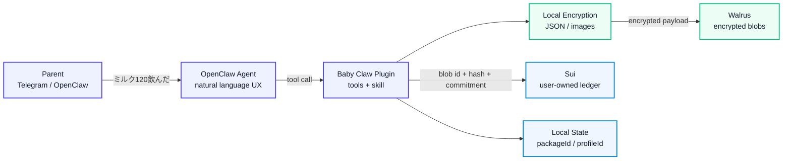
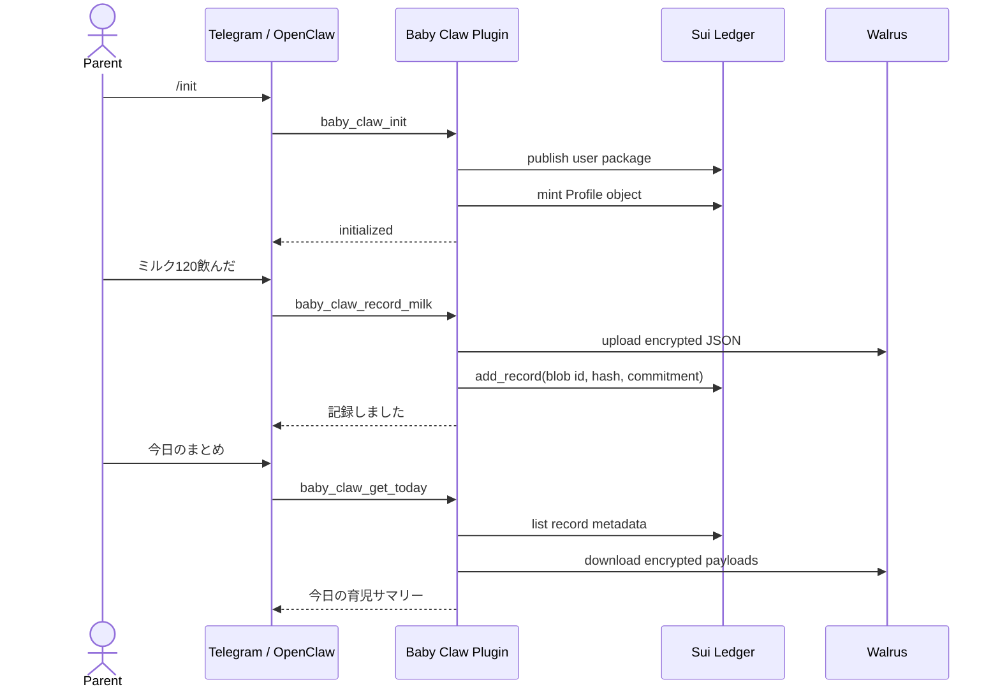
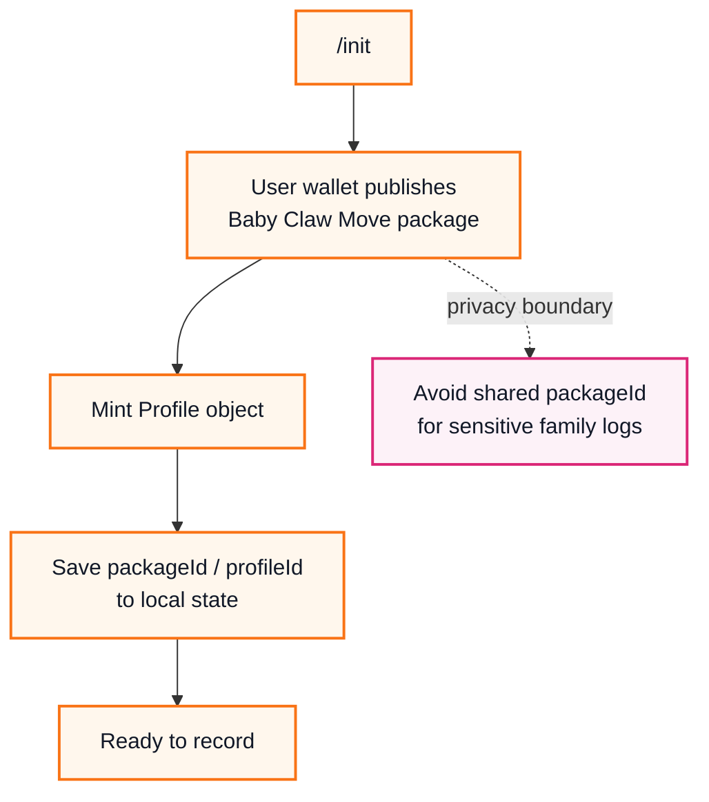
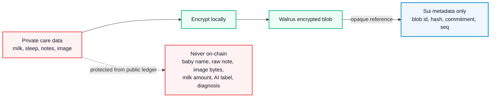

<div align="center">

# Baby Claw

**OpenClaw、Sui、Walrus のためのプライバシーファーストな育児記録。**<br/>
**Privacy-first baby care records for OpenClaw, Sui, and Walrus.**

日本語 TL;DR: Baby Claw は、チャットから育児イベントを記録しつつ、センシティブな詳細をオフチェーンで暗号化して保つ OpenClaw plugin MVP です。Sui にはプライバシー中立な検証メタデータだけを保存し、Walrus には暗号化済み payload と画像を保存します。

English TL;DR: Baby Claw is an OpenClaw plugin MVP for recording baby care events through chat while keeping sensitive details encrypted off-chain. Sui stores only privacy-neutral verification metadata, and Walrus stores encrypted payloads and images.


</div>

## 何を作ったか / What We Built

Baby Claw は、Telegram / OpenClaw から「ミルク120飲んだ」「寝た」「今日のまとめ」のような自然文で育児ログを扱うための、プライバシー重視の OpenClaw Plugin MVP です。

Baby Claw is a privacy-focused OpenClaw Plugin MVP for handling baby care logs from Telegram / OpenClaw through natural language such as "drank 120 ml of milk," "fell asleep," or "today's summary."

育児記録には、生活リズム、メモ、画像、健康状態を推測できるセンシティブな情報が含まれます。Baby Claw は、詳細データをそのままブロックチェーンへ載せず、**Sui には検証用メタデータだけ**、**Walrus には暗号化済みペイロードだけ**を保存する構成を採ります。

Baby care records can include sensitive information that reveals daily rhythms, notes, images, and health-related context. Baby Claw avoids putting detailed data directly on-chain and instead stores **only verification metadata on Sui** and **only encrypted payloads on Walrus**.



## ハイライト / Highlights

| 観点 / Area | Baby Claw の見せどころ / What Baby Claw Demonstrates |
| --- | --- |
| 体験<br/>Experience | Telegram / OpenClaw から育児ログを自然文で扱う agent-native UX<br/>An agent-native UX for handling baby care logs in natural language from Telegram / OpenClaw |
| プライバシー<br/>Privacy | Sui にはミルク量、睡眠詳細、画像、メモを保存しない<br/>Milk amounts, sleep details, images, and notes are not stored on Sui |
| 分散ストレージ<br/>Decentralized Storage | Walrus に暗号化済み JSON / 画像 blob を保存する設計<br/>A design that stores encrypted JSON and image blobs on Walrus |
| 所有権<br/>Ownership | `/init` で利用者ごとに Sui Move package を publish する方針<br/>A plan to publish a Sui Move package per user through `/init` |
| 検証性<br/>Verifiability | on-chain metadata により改ざん検知や将来の監査導線を確保<br/>On-chain metadata supports tamper detection and future audit paths |

## デモで見せる体験 / Demo Experience

最終デモ体験は、親がいつものチャットに短く入力するだけで、記録、保存、確認まで進むことです。

The final demo experience lets a parent record, store, and review care events by typing short messages in their usual chat.



### 想定入力 / Example Inputs

```text
/init
ミルク120飲んだ
寝た
起きた
/poop + 画像
今日のまとめ
最後の記録
```

## MVP 実装状況 / MVP Implementation Status

このリポジトリはハッカソン提出用の MVP です。現時点では、プライバシー重視の土台となる contract / client / storage 層を中心に実装しています。

This repository is an MVP for hackathon submission. At this stage, the implementation focuses on the privacy-oriented foundation: the contract, client, and storage layers.

| 領域 / Area | 状態 / Status | 内容 / Details |
| --- | --- | --- |
| OpenClaw Plugin | 実装済み<br/>Implemented | `baby_claw_healthcheck`、`baby_claw_status`、記録・取得系 tools<br/>`baby_claw_healthcheck`, `baby_claw_status`, and record/retrieval tools |
| Config / Local State | 実装済み<br/>Implemented | private key を返さず、`packageId` / `profileId` を state 管理<br/>Manages `packageId` / `profileId` in state without returning the private key |
| Sui Move Contract | 実装済み<br/>Implemented | `ledger::Profile`、`Record`、Dynamic Field records<br/>`ledger::Profile`, `Record`, and Dynamic Field records |
| Move Tests | 実装済み<br/>Implemented | mint、record追加、owner制御、空 payload 拒否など<br/>Covers minting, record creation, owner controls, empty payload rejection, and more |
| Runtime Artifact | 実装済み<br/>Implemented | Plugin から publish するための package artifact<br/>Package artifact used for publishing from the plugin |
| Sui Client | 実装済み<br/>Implemented | publish、mint、add/list/get record の client layer<br/>Client layer for publish, mint, and add/list/get record flows |
| Walrus / Crypto Client | 実装済み<br/>Implemented | 暗号化 JSON / 画像 blob の保存・復号・tamper拒否<br/>Stores and decrypts encrypted JSON / image blobs and rejects tampering |
| Natural Language Tools | 実装済み<br/>Implemented | `record_milk`、`sleep_start/end`、`record_poop`、`get_today`、`get_last`<br/>`record_milk`, `sleep_start/end`, `record_poop`, `get_today`, and `get_last` |
| Telegram Demo | 要環境設定<br/>Requires environment setup | Sui private key を gateway 環境変数に設定後に確認。Walrus endpoint は公式 Testnet endpoint を default 使用<br/>Can be verified after setting the Sui private key in the gateway environment. Walrus uses the official Testnet endpoint by default |

## なぜ「利用者ごとに publish」するのか / Why Publish Per User

Sui の transaction、object、package、実行タイミングは公開情報です。共有の公式 `packageId` に全ユーザーの育児ログが集まると、利用者同士の行動パターンが関連付けられやすくなります。

Sui transactions, objects, packages, and execution timing are public information. If every user's baby care logs gather under a shared official `packageId`, user behavior patterns become easier to correlate.

Baby Claw では、初回 `/init` で利用者のウォレットから Move package を publish し、その package の下に Profile と Record を作ります。

In Baby Claw, the first `/init` publishes the Move package from the user's wallet and creates the Profile and Records under that package.



## データ設計 / Data Design

Baby Claw は、公開台帳に出す情報を最小限にします。

Baby Claw minimizes the information exposed to the public ledger.



| 保存先 / Location | 保存するもの / Stored | 保存しないもの / Not Stored |
| --- | --- | --- |
| Sui | `Profile`、sequence、schema version、encrypted blob id、payload hash、record commitment<br/>`Profile`, sequence, schema version, encrypted blob id, payload hash, and record commitment | 赤ちゃんの名前、ミルク量、睡眠詳細、画像、メモ、診断<br/>Baby name, milk amount, sleep details, images, notes, or diagnosis |
| Walrus | 暗号化済み JSON、暗号化済み画像<br/>Encrypted JSON and encrypted images | 平文 payload、平文画像、暗号鍵<br/>Plaintext payloads, plaintext images, or encryption keys |
| Local State | `packageId`、`profileId`、tx digest、key reference<br/>`packageId`, `profileId`, transaction digest, and key reference | private key、raw baby record、復号済み画像<br/>Private key, raw baby records, or decrypted images |

## セットアップ / Setup

### 必要条件 / Requirements

- Bun `1.3.2`<br/>Bun `1.3.2`
- OpenClaw `2026.4.9`<br/>OpenClaw `2026.4.9`
- Sui CLI: Move contract の build / test を行う場合<br/>Sui CLI: required when building or testing the Move contract
- Sui testnet wallet の private key<br/>Sui testnet wallet private key
- Walrus publisher / aggregator endpoint<br/>Walrus publisher / aggregator endpoints

### インストール / Install

```bash
bun install
bun run build
bun run test
```

### コントラクト確認 / Contract Checks

```bash
bun run build:contract-artifact -- --check
cd contracts && sui move test
```

### OpenClaw 設定例 / OpenClaw Config Example

```jsonc
{
  "plugins": {
    "entries": {
      "baby_claw": {
        "enabled": true,
        "config": {
          "suiNetwork": "testnet",
          "suiPrivateKey": "${SUI_PRIVATE_KEY}",
          "stateDir": "~/.openclaw/baby_claw",
          "encryptImages": true,
          "walrusEpochs": 1
        }
      }
    }
  }
}
```

`suiPrivateKey` は `${ENV_NAME}` 形式で環境変数参照にできます。OpenClaw gateway を systemd で動かす場合は、gateway service に以下の環境変数を渡してください。

`suiPrivateKey` can reference an environment variable in the `${ENV_NAME}` format. If you run the OpenClaw gateway through systemd, pass the following environment variable to the gateway service.

```text
SUI_PRIVATE_KEY=suiprivkey...
```

Walrus endpoint は未指定なら、Walrus 公式 docs が HTTP API 例として示している Testnet endpoint を使います。

If Walrus endpoints are not specified, Baby Claw uses the Testnet endpoints shown as HTTP API examples in the official Walrus docs.

```text
walrusPublisherUrl=https://publisher.walrus-testnet.walrus.space
walrusAggregatorUrl=https://aggregator.walrus-testnet.walrus.space
```

必要な場合だけ、`walrusPublisherUrl` と `walrusAggregatorUrl` を明示指定するか `${WALRUS_PUBLISHER_URL}` / `${WALRUS_AGGREGATOR_URL}` 形式で上書きできます。

Only when needed, you can explicitly set `walrusPublisherUrl` and `walrusAggregatorUrl`, or override them in the `${WALRUS_PUBLISHER_URL}` / `${WALRUS_AGGREGATOR_URL}` format.

この PC でのローカル path install 例:

Example local path install on this PC:

```bash
openclaw plugins install -l .
openclaw plugins enable baby_claw
openclaw config set plugins.entries.baby_claw.config.suiNetwork '"testnet"' --strict-json
openclaw config set plugins.entries.baby_claw.config.suiPrivateKey '"${SUI_PRIVATE_KEY}"' --strict-json
openclaw config set plugins.entries.baby_claw.config.stateDir '"~/.openclaw/baby_claw"' --strict-json
openclaw config set plugins.entries.baby_claw.config.encryptImages true --strict-json
openclaw config set plugins.entries.baby_claw.config.walrusEpochs 1 --strict-json
systemctl --user restart openclaw-gateway.service
```

OpenClaw が plugin config だけを受け取る環境では、次の形でも同じ値を渡せます。

In environments where OpenClaw receives only the plugin config, you can pass the same values in the following form.

```jsonc
{
      "suiNetwork": "testnet",
      "suiPrivateKey": "${SUI_PRIVATE_KEY}",
      "stateDir": "~/.openclaw/baby_claw",
      "encryptImages": true,
      "walrusEpochs": 1
}
```

### ランタイム確認 / Runtime Inspection

```bash
openclaw plugins inspect baby_claw --runtime --json
```

現在登録される tools:

Current registered tools:

```text
baby_claw_healthcheck
baby_claw_init
baby_claw_status
baby_claw_record_milk
baby_claw_sleep_start
baby_claw_sleep_end
baby_claw_record_poop
baby_claw_get_today
baby_claw_get_last
```

## リポジトリ構成 / Repository Map

```text
src/
  clients/       Sui、Walrus、暗号化 client / Sui, Walrus, and crypto clients
  tools/         OpenClaw tool handler / OpenClaw tool handlers
  artifacts/     実行時 Move package artifact / Runtime Move package artifact
contracts/
  sources/       Sui Move の ledger module / Sui Move ledger module
  tests/         Move test / Move tests
skills/
  baby_claw/     OpenClaw skill instruction / OpenClaw skill instructions
tests/           plugin と client の Bun test / Bun tests for plugin and clients
docs_implement/  MVP 実装計画 / MVP implementation plan
```

## セキュリティとプライバシーの注意 / Security and Privacy Notes

- Baby Claw は医療機器ではなく、医学的診断を提供しません。<br/>Baby Claw is not a medical device and does not provide medical diagnosis.
- private key、encryption key、raw baby record、image data、unencrypted note を log や chat response に出さないでください。<br/>Do not put private keys, encryption keys, raw baby records, image data, or unencrypted notes in logs or chat responses.
- Sui は公開台帳です。privacy-neutral metadata だけでも、transaction timing、wallet activity、gas usage、object ownership は観測される可能性があります。<br/>Sui is a public ledger. Even with privacy-neutral metadata, transaction timing, wallet activity, gas usage, and object ownership can be observable.
- Walrus payload と image は upload 前に必ず暗号化してください。<br/>Walrus payloads and images must be encrypted before upload.
- MVP では、`add_milk` や `add_poop` のような on-chain function name を意図的に避け、generic な `add_record` flow で記録を保存します。<br/>The MVP intentionally avoids on-chain function names such as `add_milk` or `add_poop`; records are stored through a generic `add_record` flow.
