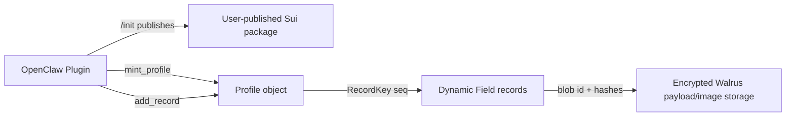

# プライバシーファーストなコントラクト設計

## Overview

この文書は、Step 4 で実装する Sui/Walrus コントラクトの設計です。
基本方針は「詳細な育児データをオンチェーンに載せない」ことです。Sui
には所有者、連番、暗号化済みペイロードへの参照、検証用メタデータだけを
保存します。Walrus には暗号化済み JSON ペイロードと暗号化済み画像を保存
します。

各ユーザーは `/init` の実行時に、自分のウォレットで `baby_claw` Move
package を publish します。通常運用では共有の公式 `packageId` は使いませ
ん。これにより疑似匿名性は高まりますが、完全な匿名性は得られません。Sui
のトランザクション、Object 所有者、package publish、実行タイミング、gas
使用量は公開情報です。



## Privacy Model

Sui は公開台帳です。オンチェーンに書いた値は、永続的に見えるメタデータと
して扱います。

オンチェーンに保存してよいもの:
- 暗号化済みペイロードの Walrus blob id。
- ペイロード hash。
- record commitment。
- sequence number。
- schema version。
- bucket 化された timestamp。

オンチェーンに保存してはいけないもの:
- 赤ちゃんの名前。
- ミルク量。
- 睡眠時間。
- 画像 bytes。
- AI 判定。
- 診断。
- 生のメモ。
- 詳細な育児 payload。

Walrus のペイロードと画像は、upload 前に必ず暗号化します。コントラクトは
育児データを暗号化、復号、parse、validate しません。MVP では event を
emit しません。event は index しやすい一方で、公開情報の関連付けも容易に
するためです。

## Package / Module Design

Package 方針:
- `/init` はユーザーウォレットごとに package を publish します。
- Plugin はユーザーの package id を local state に保存します。
- 共有 `packageId` での運用はサポートしません。

Module/API 方針:
- Module 名は `ledger`。
- Entry function は `mint_profile` と `add_record`。
- `add_milk`、`add_sleep`、`add_poop` など、意味が漏れる on-chain function
  は設計しません。
- privacy-neutral な名前として `Profile`、`Record`、`RecordKey` を使います。

Step 4 では Move 2024 の least-privilege visibility に従います。基本は
private `fun`、package 内の共通処理だけ `public(package)`、PTB から呼ぶ
API だけ薄い `entry` function にします。

## Struct Design

### `Profile`

ユーザーが所有する root object です。

```move
public struct Profile has key {
    id: UID,
    owner: address,
    next_seq: u64,
    schema_version: u16,
    created_at_ms: u64,
}
```

各 field の意味:
- `id`: Sui object id。
- `owner`: record を追加できる唯一の address。
- `next_seq`: record sequence number の唯一の発行元。
- `schema_version`: profile schema version。
- `created_at_ms`: `Clock` から取得した profile 作成時刻。

### `RecordKey`

1 件の record に対応する Dynamic Field key です。

```move
public struct RecordKey has copy, drop, store {
    seq: u64,
}
```

### `Record`

暗号化済み育児 payload 1 件分の公開メタデータです。

```move
public struct Record has store {
    seq: u64,
    payload_blob_id: vector<u8>,
    payload_hash: vector<u8>,
    record_commitment: vector<u8>,
    created_at_ms: u64,
    schema_version: u16,
}
```

`Record` には care type、量、時間、メモ、画像分類、診断、その他の private
payload field を含めてはいけません。

## Storage Design

`Record` は Sui Dynamic Field として `Profile` の下に保存します。

Rules:
- key は `RecordKey { seq }`。
- `Record.seq` は現在の `Profile.next_seq` を使います。
- caller から sequence number を受け取りません。
- insert 成功後に `next_seq` を `1` 増やします。
- 既存 record を上書きしません。
- Sui には暗号化済み payload 参照と検証用メタデータだけを保存します。

この設計により、record はユーザーの profile に紐づきます。同時に、milk、
sleep、poop、image などの公開 object 名を作らずに済みます。

## Walrus Payload Design

Walrus には暗号化済みデータだけを保存します。暗号化済み JSON には、care
category、量、睡眠時刻、メモ、timezone、暗号化済み画像 blob 参照、将来の
AI label などの private field を含められます。画像は upload 前に暗号化し
ます。JSON が画像を参照する場合は、暗号化済み画像 blob id を参照します。

推奨 flow:
1. Plugin がユーザー request または画像を受け取る。
2. Plugin が private JSON を作る。
3. Plugin が JSON と画像を local で暗号化する。
4. Plugin が暗号化済み blob を Walrus に upload する。
5. Plugin が `payload_hash` と `record_commitment` を計算する。
6. Plugin が opaque metadata だけで `add_record` を呼ぶ。

鍵管理は Move の外側で行います。Plugin は encryption key、生 payload、画像
bytes、復号済みメモを log に出してはいけません。

## Function Specification

### `mint_profile`

`tx_context::sender` が所有する `Profile` を作成します。

Inputs: `schema_version: u16`, `clock: &Clock`, `ctx: &mut TxContext`。

Behavior: `tx_context::sender` から sender を読み、新しい `Profile` を作成し、
`owner` に sender、`next_seq` に `0`、`schema_version` と `created_at_ms` を
設定し、profile を sender に transfer します。

### `add_record`

profile に暗号化済み payload 参照を 1 件 append します。

Inputs: `profile: &mut Profile`, `payload_blob_id: vector<u8>`,
`payload_hash: vector<u8>`, `record_commitment: vector<u8>`,
`created_at_ms: u64`, `schema_version: u16`, `ctx: &mut TxContext`。

Behavior:
- caller が `Profile.owner` であることを要求します。
- `payload_blob_id` が空なら abort します。
- `payload_hash` が空なら abort します。
- `record_commitment` が空なら abort します。
- 現在の `next_seq` を `Record.seq` として使います。
- record を profile の Dynamic Field として追加します。
- `next_seq` を `1` 増やします。
- MVP では event を emit しません。

## Access Control

record を追加できるのは owner だけです。MVP では caregiver permission、
delegation、shared custody、multi-signature control、revocation は実装しませ
ん。

Profile transfer は通常の Sui object ownership rule により可能です。ただし、
transfer 先は将来の record を append できるようになるため、app UX では
advanced かつ non-primary な操作として扱います。

## Abort Conditions

推奨 abort constant: `ENotOwner`, `EEmptyPayloadBlobId`,
`EEmptyPayloadHash`, `EEmptyRecordCommitment`, `ESequenceOverflow`。

Required behavior:
- owner 以外の `add_record` は abort します。
- 空の `payload_blob_id` は abort します。
- 空の `payload_hash` は abort します。
- 空の `record_commitment` は abort します。
- 失敗した call は `Profile` を部分的に変更しません。

## Testing Plan

この design document だけを追加した後に実行する確認:

```bash
bun run build
bun run test
openclaw gateway restart
openclaw plugins inspect baby_claw --json
```

期待する plugin inspection:
- `status` が `"loaded"`。
- `toolNames` に `baby_claw_healthcheck` が含まれる。
- `toolNames` に `baby_claw_status` が含まれる。

Step 4 の Move tests:
- `mint_profile` が成功する。
- `add_record` が成功する。
- `next_seq` が increment される。
- owner 以外は `add_record` できない。
- 空の `payload_blob_id` は abort する。
- 空の `payload_hash` は abort する。
- 空の `record_commitment` は abort する。
- 複数 record が互いに overwrite されない。

## Future Extensions

将来拡張としては、caregiver permission、暗号鍵共有による read-only sharing、
privacy review 済み event、app view 用の record deletion marker、schema
migration helper、wallet ごとの複数 profile、local state 復旧 flow が考えら
れます。

どの拡張でも、Sui に保存する情報は opaque reference と verification metadata
だけに制限します。

## Open Questions / Decisions

決定事項:
- `/init` で wallet ごとに user-published package を作る。
- 共有公式 `packageId` は使わない。
- Module 名は `ledger`。
- generic entry function は `mint_profile` と `add_record` のみ。
- record は `Profile` 下の Dynamic Field として保存する。
- `Profile.next_seq` を唯一の sequence source にする。
- MVP では event を emit しない。

未決事項:
- `payload_hash` の hash algorithm と canonical byte format。
- `record_commitment` の commitment scheme。
- local key storage と recovery strategy。
- package upgrade を MVP で扱うかどうか。
